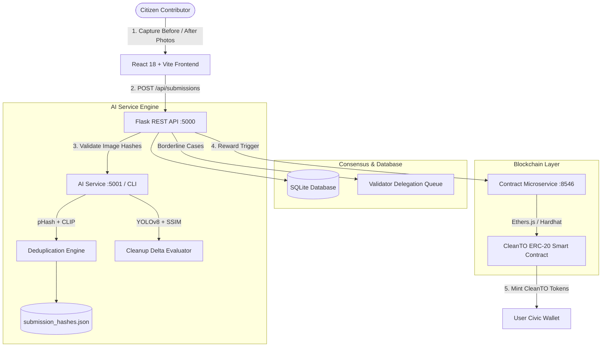

# CleanTO — Complete Project Implementation & Review Report

> **Project Name:** CleanTO (Decentralized Proof-of-Cleanup Protocol)  
> **Repository:** `SAMJOD07-devz/CleanTo-IDP`  
> **Branch:** `develop2`  
> **Date:** October 2026  
> **Status:** Fully Integrated, Tested, and Running Locally  

---

## 1. Executive Summary

**CleanTO** is an end-to-end civic infrastructure platform that transforms physical municipal waste cleanup into cryptographic, verifiable on-chain environmental impact. By pairing computer vision with decentralized consensus, the system prevents "greenwashing" and fraudulent bounty claims through multi-layer verification:

1. **Hardware Telemetry Verification:** Enforces real-time GPS boundary locks and temporal intervals between "Before" and "After" photos to prevent staged cleanups.
2. **AI-Powered Deduplication & Delta Audit:** Employs perceptual hashing (pHash) and neural embeddings (CLIP) to catch image reuse, alongside YOLOv8 object detection and structural similarity (SSIM) to evaluate true cleanup delta.
3. **Delegated Proof-of-Stake (DPoS) Validation:** Submissions with borderline AI confidence are escalated to human community validators who stake tokens on their verdicts.
4. **Instant On-Chain Token Minting:** Verified cleanups automatically trigger gasless, smart contract-backed minting of non-speculative CleanTO reward points.

---

## 2. End-to-End Architecture Overview



---

## 3. Comprehensive Implementation History (From Start to Present)

### Phase 1 — Blockchain & Smart Contract Foundation
- **CleanTO Token Contract (`CleanTOToken.sol`):** ERC-20 utility token representing verified municipal remediation units. Includes gas-sponsored minting restricted to authorized system verifier keys.
- **Contract Service (`scripts/contract_service.js`):** Lightweight Node.js microservice running on port `8546` that exposes HTTP endpoints for checking wallet balances, queuing minting transactions, and listening to block confirmations.
- **Local Hardhat Testnet:** Automated migration scripts and mock consortium signers.

### Phase 2 — Multi-Modal AI Verification Service
- **Perceptual Deduplication (`ai-service/duplicate_detector.py`):**
  - **pHash (Perceptual Hash):** Fast Hamming-distance screening (detects re-uploaded or compressed images).
  - **Neural Embeddings:** CLIP-based cosine similarity to detect cropped, flipped, or color-manipulated images.
  - **Dynamic Hash Registry (`submission_hashes.json`):** Persistent audit log containing hashes, filenames, and ISO UTC timestamps.
- **Cleanup Delta Evaluator (`ai-service/evaluator.py`):**
  - YOLOv8 waste detection model identifying bottles, cans, plastic bags, and debris volume.
  - Contour analysis and Structural Similarity Index (SSIM) comparing pre-cleanup and post-cleanup frames.

### Phase 3 — Backend API & Data Integrity Layer
- **Flask REST API (`backend/app.py`):** Modular blueprints for authentication, submissions, validation workflows, leaderboard, and analytics.
- **Database Architecture (`backend/db.py`):** SQLite schema with automatic table migrations covering `users`, `submissions`, `validations`, `validator_stakes`, and `token_transactions`.
- **Anti-Fraud Security Controls:**
  - Hardware GPS distance radius matching against target zone.
  - Minimum time duration enforcement between initial photo and completion photo.
  - Role-Based Access Control (Contributor vs. Validator vs. Admin).

### Phase 4 — Frontend Web Application
- **Stack:** React 18, Vite, Tailwind CSS, Framer Motion, Lucide Icons, React Router.
- **Design System:** "Audited Ledger" aesthetic featuring warm civic tones (Cream `#F7F5F0`, Charcoal `#171717`, Coral Orange `#E84C32`, Olive `#4D5737`).
- **Pages & Modules:**
  - **Landing Page (`LandingPage.jsx`):** Interactive hero with real before/after proof slider, live counters, 5-step verification workflow, and recent audited ledger entries.
  - **Citizen Submission Wizard (`SubmitCleanup.jsx`):** Multi-step upload with real-time EXIF/GPS coordinate extraction and camera capture.
  - **Validator Staking Portal (`ValidatorPortal.jsx`):** Community queue for reviewing escalated cleanups, voting with staked tokens, and earning validation fees.
  - **Public Explorer (`Explorer.jsx`):** Transparent audit ledger of all completed cleanups, hash proofs, and transaction IDs.
  - **Dev Drawer (`DevDrawer.jsx`):** Fast debugging tools (toggle mock mode, fast-forward time, replay intro, inspect active state).

---

## 4. What Was Built for THIS Specific Review

This milestone focused on **backend-frontend harmonization, automated testing, real photographic evidence, landing page elevation, and an interactive 3D WebGL introduction experience**:

### A. Backend & AI Service Harmonization
1. **SQLite Migration Bug Resolution:** Fixed an operational SQLite error in [`backend/db.py`](file:///backend/db.py) where `ALTER TABLE ADD COLUMN updated_at` failed on pre-existing columns. Added an explicit `PRAGMA table_info()` guard.
2. **Idempotent Automated Test Suite:** Fixed unique constraint collisions in [`backend/test_api.py`](file:///backend/test_api.py) by generating dynamic UUID test users, ensuring clean runs on repeated test executions.
3. **Python Environment Fix:** Configured Windows User PATH and [`.vscode/settings.json`](file:///.vscode/settings.json) to eliminate IDE interpreter warnings.
4. **All Test Suites Passing:**
   - `py ai-service/test_duplicate_detector.py` -> **6/6 Tests Passing**
   - `py backend/test_api.py` -> **6/6 Tests Passing**

### B. ISO Timestamps in AI Submission Hashes
1. Enhanced [`ai-service/submission_hashes.json`](file:///ai-service/submission_hashes.json) to store full ISO UTC timestamps (`submission_time`) for all historical submissions.
2. Updated [`ai-service/duplicate_detector.py`](file:///ai-service/duplicate_detector.py) to dynamically attach timestamps on hash generation and return them in duplicate query matches.

### C. Landing Page Visual Polish Pass (`LandingPage.jsx`)
1. **Real Waste Cleanup Imagery:** Replaced generic nature/plant photos with real before-and-after littered site imagery (`cleanup_before.jpg` vs `cleanup_after.jpg`) with an interactive Before/After toggle and split view.
2. **Typography Polish:** Redesigned the hero heading into a balanced 2-line institutional headline:
   > *"Turn Physical Waste into Verifiable On-Chain Impact."*
3. **Elevated 3-Stat Evidence Card:**
   - Circular progress ring displaying **88% AI Delta Reduction**.
   - Verified Unique badge for **0.02 pHash Match**.
   - Coral orange accent badge for **+45.0 CleanTO Reward Issued**.
4. **Trust Signals:** Integrated line icons for GPS UTC locks, pHash deduplication, and DPoS stake security.
5. **Component Styling:** Replaced generic drop shadows with layered elevation tokens (`shadow-[0_12px_36px_rgba(23,23,23,0.08)]`).

### D. Interactive 3D Intro Animation (`IntroScene.jsx`)
Built an interactive 3D WebGL simulation powered by **Three.js** and **React Three Fiber**:
1. **Civic Dustbin Model:**
   - Polished aluminum upper rim with an open hollow aperture where flying debris funnels.
   - Architectural vertical slats, weighted pedestal base, and CleanTO signature coral accent band.
   - Front embossed recycling badge.
   - Hinged hooded canopy lid that starts open and snaps shut with an authoritative thud upon capture.
   - Swirling green interior energy vortex.
2. **Cinematic Impact Shockwave:**
   - 3D expanding concentric shockwave ring synchronized with lid snap.
   - Camera micro-shake effect during capture impact.
   - Radial lens bloom vignette transition.
3. **Tapered Warp Streaks:**
   - Procedural cone geometries with glowing heads (`emissiveIntensity: 3.5`) that taper back to needle points and stretch during acceleration.
4. **Atmospheric Space & Depth:**
   - Volumetric exponential space fog (`fogExp2`) preventing flat black voids.
   - 350-particle drifting starfield with subtle rotation and multi-light rim illumination.
5. **Hero Overlay & Legibility:**
   - Headline: *"From scattered waste to verified impact."*
   - Radial dark backdrop scrim ensuring 100% text legibility over moving 3D objects.
   - Orbital clearance radius pushing debris outward so it frames the headline instead of occluding it.
   - Action button: `Begin Cleanup Sequence →`.
6. **Smart Refresh Tracking:**
   - In-memory lifecycle in [`App.jsx`](file:///frontend/src/App.jsx) guarantees the 3D Intro **plays on every browser refresh (F5)**, while preserving instant SPA routing between internal pages.
   - One-click replay button added to the **Dev Drawer** (`Ctrl+Shift+D`).

### E. Git & Branch Hygiene
- All changes cleanly committed to commit `3d12a5b`.
- Pushed strictly to **`develop2`** on GitHub:
  ```bash
  git push origin develop2
  # 88c2747..3d12a5b  develop2 -> develop2
  ```

---

## 5. Live Service Status & Verification Matrix

| Component | Port / Command | Status | Verification Check |
| :--- | :--- | :--- | :--- |
| **Flask Backend API** | `http://127.0.0.1:5000` | **Running** (Daemon) | `py app.py` |
| **Blockchain Service** | `http://localhost:8546` | **Running** (Daemon) | `node scripts/contract_service.js serve 8546` |
| **Frontend Dev Server** | `http://localhost:3000` | **Running** (Daemon) | `npm run dev` (Vite 6) |
| **Backend Test Suite** | `py backend/test_api.py` | **Passed (6/6)** | 100% passing tests with isolated UUIDs |
| **AI Deduplication Suite**| `py ai-service/test_duplicate_detector.py`| **Passed (6/6)** | pHash, CLIP, and timestamps verified |
| **Production Build** | `npm run build` | **Passed (0 Errors)**| 2,651 modules transformed cleanly |

---

## 6. How to Run and Demo the Application

1. **Open the App in Browser:**
   Visit **[http://localhost:3000](http://localhost:3000)**.
2. **Experience the 3D Intro:**
   - Watch the floating procedural plastic bottles, cups, and bags orbit in 3D deep space.
   - Click **`Begin Cleanup Sequence`** to initiate the warp jump, funneling debris into the civic bin with lid slam, shockwave, and flash.
   - Refresh the page (**F5**) anytime to replay the intro, or press **`Ctrl+Shift+D`** to open the Dev Drawer and click **Replay 3D Intro**.
3. **Explore the Polished Landing Page:**
   - Toggle the Before/After photo comparison slider on the hero audit evidence placard.
   - Review the live impact stats, 5-step consensus process, and public ledger table.
4. **Test the API & AI Service:**
   ```powershell
   # Run Backend API tests
   py backend/test_api.py

   # Run AI Deduplication tests
   py ai-service/test_duplicate_detector.py
   ```
